# DÚVIDAS JITTERBIT

## Como pegar dados complexos de array de resposta de uma requisição conectores de Get Https v2?

  &emsp;&emsp;Tenho uma operation se chama Get From SalesForce By CNPJ e nela tenho apenas um conector Http V2 Get com uma transformation.  
  &emsp;&emsp;Neste caso consegui fazer tudo dentro da transformation. Ela tem um source que é um schema definido no HTTP V2 e seu target é um Flat Schema. Nesse flat Schema eu fiz um script que adiciona todas as variaveis do source em globais e que itera sobre os arrays recebidos e monta os objetos complexos com Dict() como na outra operation.  
  &emsp;&emsp;Essa seria a forma mais correta?  
  &emsp;&emsp;Essa aqui foi a primeira que consegui criar. Tentei replicar ela na operation que explicarei a seguir. Mas, apesar de replicar essa mesma lógica tive erros na execução, e só consegui fazer funcionar de oputra forma.  

  <a href="image-2.png" target="_blank">
    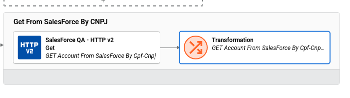
  </a>

  <a href="image-3.png">
    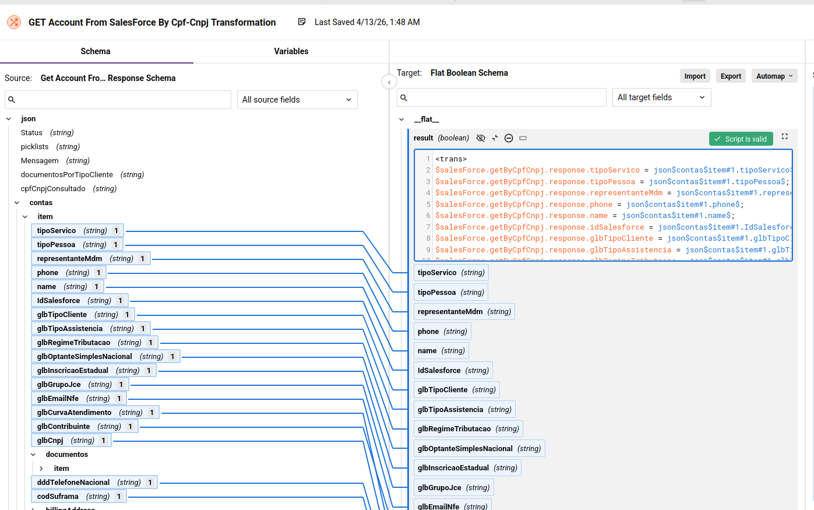
  </a>

  <a href="image-4.png">
    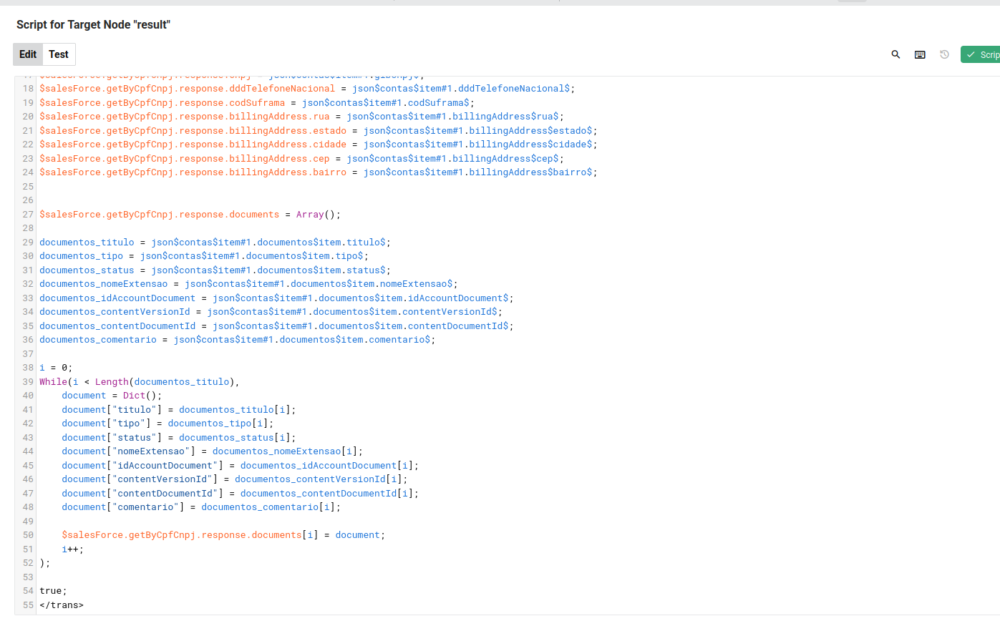
  </a>

  &emsp;&emsp;Tenho uma outra operation na qual consegui fazer diferente. Essa operation Get From cost_centers que uso um conector Http V2 Get com uma transformation e um script em seguida.  
  &emsp;&emsp;Na transformation uso a função Set para adicionar os elementos a arrays em variaveis globais. E depois no script eu percorro esses arrays para montar um array de Dict() montando algo como se fosse um objeto complexo com vários parametros.  
  &emsp;&emsp;Essa é a forma correta?  

  <a href="image-1.png">
    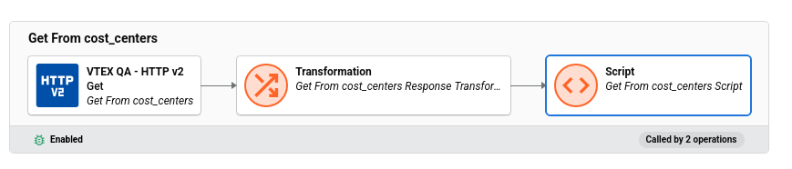
  </a>

  <a href="image-5.png">
    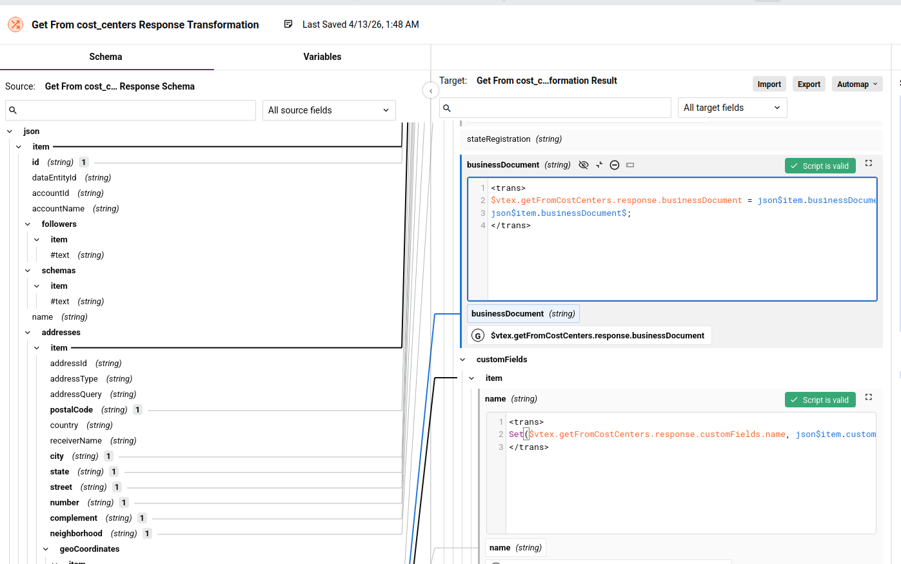
  </a>

  <a href="image-6.png">
    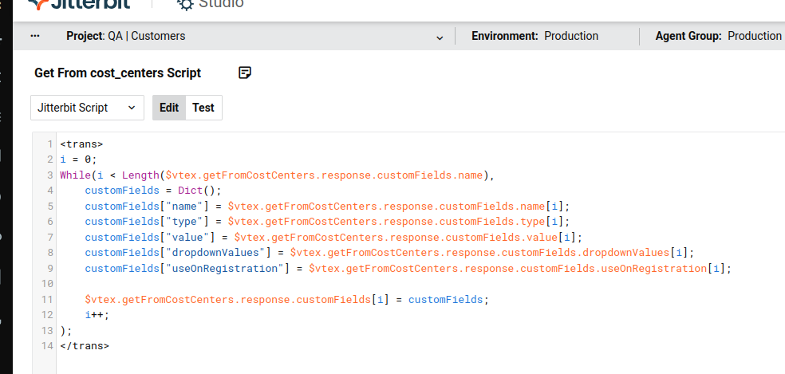
  </a>

## Como pegar dados complexos de arrays de Dicts e usá-los em conectores de requisições POST, PUT e PATCH em HTTPs V2?

  &emsp;&emsp;Usei a mesma lógica que entendi que foi o que a Quality fez: vi que eles estruturaram a operation deles assim no caso do ¨Send - ERP":  
  ```
    Variable Read => Transformation => Conector Http V2 Post => Transformation => Variable Write => Script
  ```
  &emsp;&emsp;Engraçado que a variable do Read (envioERP) deles parece ser diferente da do Write (io). Gostaria de entender o que se passa nesse caso.  

  <a href="image.png">
    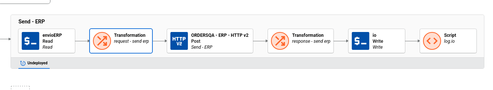
  </a>

  &emsp;&emsp;Copiei o que entendi dessa lógica na minha operation "SalesForce Update Account":  
  &emsp;&emsp;Tenho um script separado dessa operation, anterior a ela, que prepara as variaveis globais que ela vai usar e depois chama ela.  
  &emsp;&emsp;Esse script, além das globais da raiz do json de requisição prepara um array complexo chamado "arquivos". Exemplo:  
  ```json
  {
    "IdSalesforce": "0018800001EbpSoAAJ",
    "arquivos": [
        {
            "nome": "ContratoSocial",
            "nomeExtensao": "ContratoSocial.pdf",
            "tipo": "Cópia do Contrato Social",
            "base64": "JVBERi0xLjcKCjQgMCBvYmoKPDwKL0JpdHNQZXJDb21wb25lbnQgQolJUVPRgo="
        },
        {
            "nome": "ContratoSocial",
            "nomeExtensao": "ContratoSocial.pdf",
            "tipo": "Cópia do Contrato Social",
            "base64": "JVBERi0xLjcKCjQgMCBvYmoKPDwKL0JpdHNQZXJDb21wb25lbnQgQolJUVPRgo="
        }
    ]
  }
  ```
  &emsp;&emsp;Segue abaixo o exemplo de como eu fiz na operation "SalesForce Update Account":  
  
  <a href="image-7.png">
    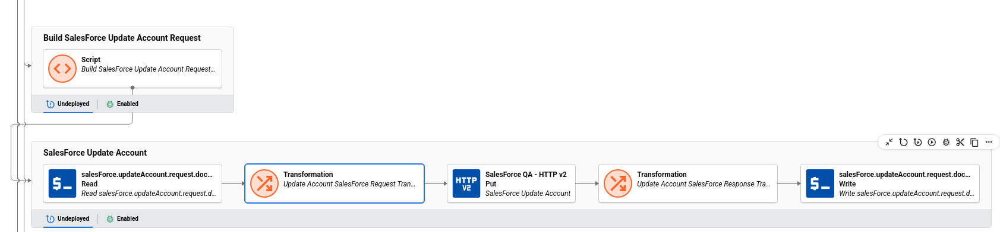
  </a>

  <a href="image-8.png">
    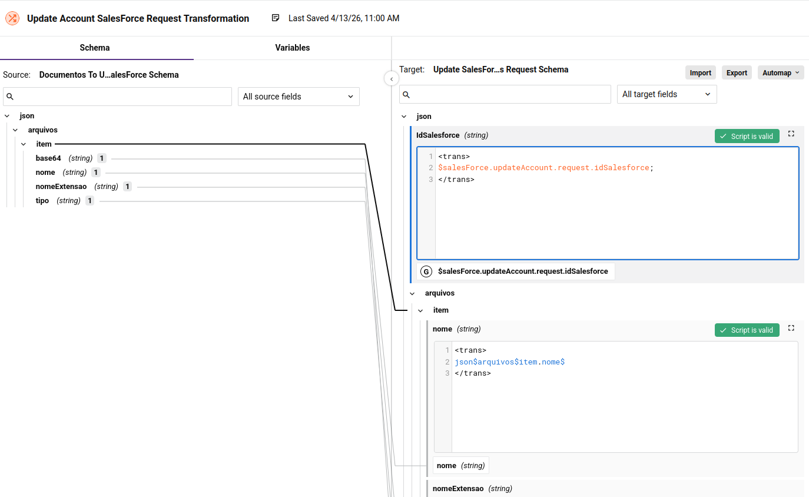
  </a>

  &emsp;&emsp;Esta operation está funcionando corretamente. Entretanto, quando fui fazer uma outra operation seguindo a mesma lógica tive erros quando a operation rodou.  
  &emsp;&emsp;A operation na qual tentei fazer a mesma coisa é a ¨Update VTEX Client CustomFields" que usa conector Http V2 Patch. Por causa dos erros eu tive que alterar e deixar ela em outro formato: a solução foi, num Script anterior a ela, criar todo o body da requisção que passaria para o Patch e passar ela na forma de string para o conector por meio de uma transformation. Para isso no conector deixei o schema do request configurado como: PROVIDE REQUEST SCHEMA: NO. E aí a transformation ficou automáticamente configurada para usar um schema padrão no seu target.  
  ```
    Transformation => Conector Http V2 Patch => Transformation
  ```
  &emsp;&emsp;A seguir os prints que mostram como ficou no final:  

  <a href="image-9.png">
    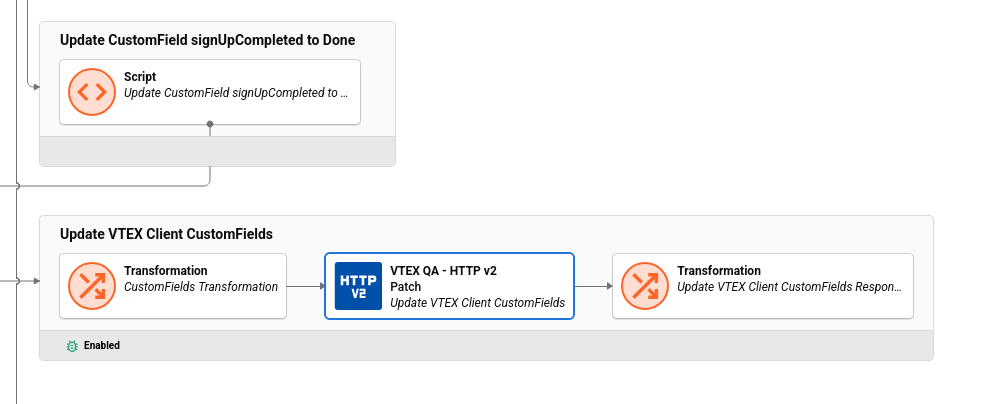
  </a>

  <a href="image-10.png">
    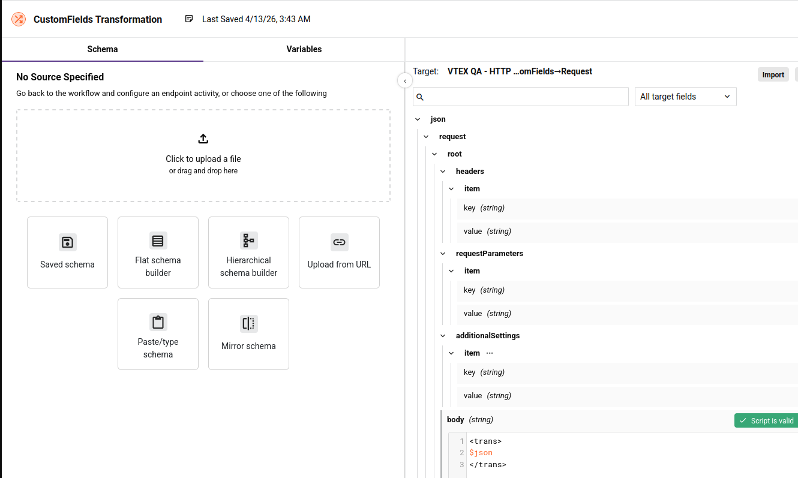
  </a>

  <a href="image-11.png">
    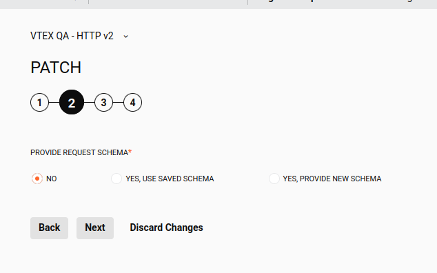
  </a>

  &emsp;&emsp;Porque não foi possível replicar a mesma solução do uso de variable neste útimo caso?  
  &emsp;&emsp;Os erros que eu tinha ao tentar usar a solução da opertion começando com variable resultavam em erros como no exemplo abaixo:  
  ```
    The operation "Update VTEX Client CustomFields" failed.
    Error: Failed to convert JSON file to XML.
    org.jitterbit.integration.server.engine.EngineSessionException: com.fasterxml.jackson.core.JsonParseException: Unexpected character ('"' (code 34)): was expecting a colon to separate field name and value
    at [Source: REDACTED (`StreamReadFeature.INCLUDE_SOURCE_IN_LOCATION` disabled); line: 1, column: 21]
    Caused by: com.fasterxml.jackson.core.JsonParseException: Unexpected character ('"' (code 34)): was expecting a colon to separate field name and value
    at [Source: REDACTED (`StreamReadFeature.INCLUDE_SOURCE_IN_LOCATION` disabled); line: 1, column: 21]
  ``` 

## Como configurar schemas de responses em conectores de requisições POST, PUT e PATCH em HTTPs V2?

  &emsp;&emsp;Fiz três operations e cada uma delas usa um conector Http V2 diferente: um POST, um PUT e um PATCH. Para cada um deles tive que configurar o response schema de uma forma diferente.  
  &emsp;&emsp;A primeira que configurei foi a operation "Upload File To SignUp Documents" usando um conector POST. Aí eu consegui configurar da forma a qual eu já tinha visto nos tutoriais: Usando um JSON de schema que eu recuperei da documentação da API para a qual estamos fazendo a requisição.  

  <a href="image-12.png">
    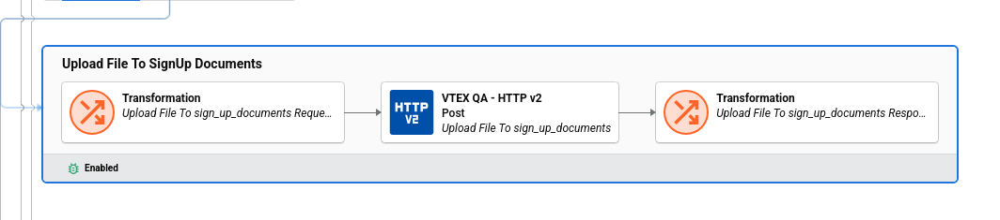
  </a>
  <a href="image-13.png">
    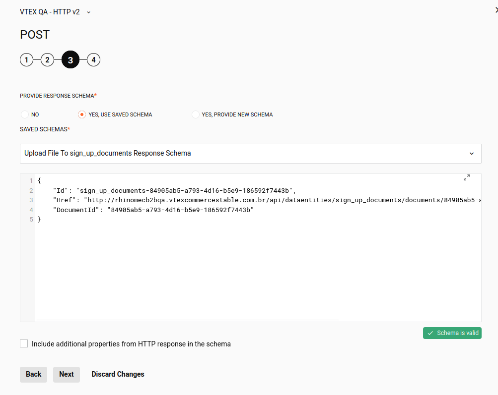
  </a>

  ```json
  {
    "Id": "sign_up_documents-84905ab5-a793-4d16-b5e9-186592f7443b",
    "Href": "http://rhinomecb2bqa.vtexcommercestable.com.br/api/dataentities/sign_up_documents/documents/84905ab5-a793-4d16-b5e9-186592f7443b?_schema=0.0.3",
    "DocumentId": "84905ab5-a793-4d16-b5e9-186592f7443b"
  }
  ```

  &emsp;&emsp;A egunda  que configurei foi a de PUT da operation "SalesForce Update Account". Essa eu tentei fazer igual à primeira acima. Mas não deu certo. eu tinha um problema toda vez que rodava: Os logs marcavam como sucesso, mas as variáveis que a transformation subsequente populava ficavam sempre vazias. Apesar de eu ver os valores sendo retornados nos xmls dos logs do debug.  

  <a href="image-14.png">
    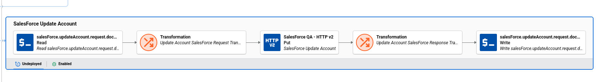
  </a>
  <a href="image-15.png">
    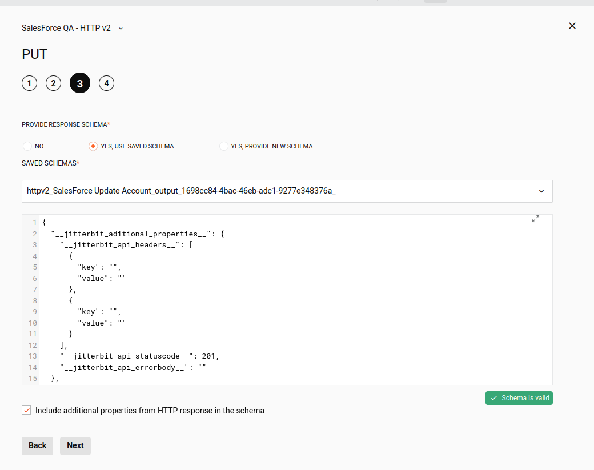
  </a>
  <a href="image-16.png">
    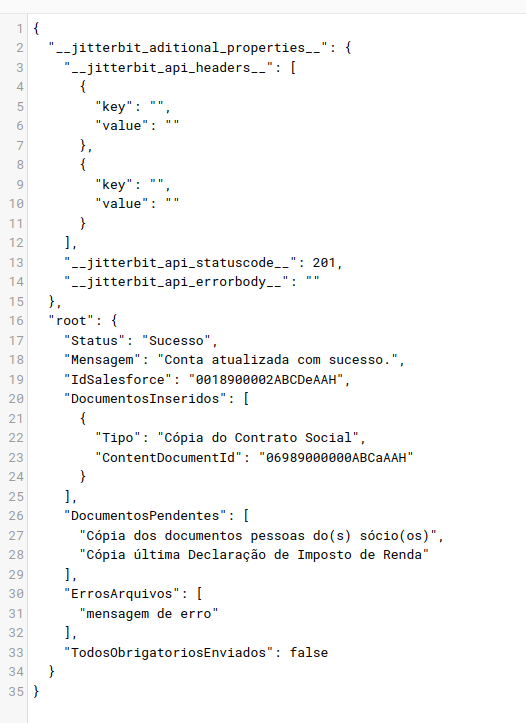
  </a>

  &emsp;&emsp;Aí eu procurei na documentação oficial da jitterbit e achei um json padrão no qual o body estava vazio:  

  ```json
  {
  "__jitterbit_aditional_properties__": {
    "__jitterbit_api_headers__": [
      {
        "key": "",
        "value": ""
      },
      {
        "key": "",
        "value": ""
      }
    ],
    "__jitterbit_api_statuscode__": 200,
    "__jitterbit_api_errorbody__": ""
    },
    "root": {
      // Original JSON
    }
  }
  ``` 

  &emsp;&emsp;Coloquei o response que recebo da requisição dentro do campo de body e usei isso tudo dentro do schema de reponse do conector e aí consegui rodar sem problemas no caso dessa operation. Só aí as varáveis passaram a ter os seus valores populados corretamente pela transformation posterior do conector.  
  &emsp;&emsp;E teve ainda um último caso de uma operation, chamada "Update VTEX Client CustomFields" que usa um conector Patch na qual eu não coloquei nenhum json no scham de response. Esta última não tive problemas porque dela eu não retiro nenhum valor da resposta para colocar em nenhuma variável. Mas é mais um jeito de realizar a configuração.  

  <a href="image-17.png">
    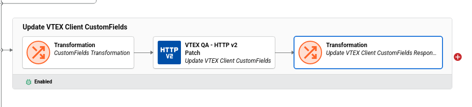
  </a>
  
  &emsp;&emsp;Procurei na Jitterbit University por algum curso que ensinasse os detalhes do uso de transformations com conectores HTTP V2 mas não achei nada. E nem na documentação oficial achei nenhuma informação que me ajudasse a entender este último caso em detalhe. O porque dos erros, o porque de não popular as variáveis, qual é o padrão correto a ser utilizado, etc.  
  &emsp;&emsp;Gostaria de saber em relação a essas questões.

